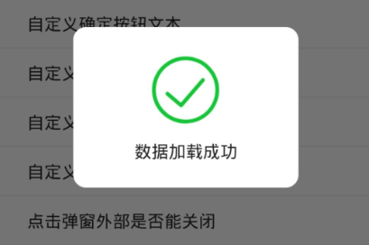
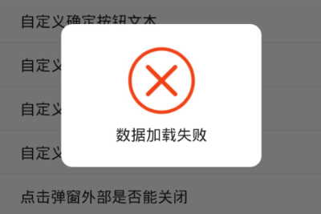

# flutter_dialog

### 部分效果图
    
  
  


### 参数说明
|属性|说明|类型|默认值
|---|---|---|---
|title|弹窗标题|String|-
|content|弹窗内容|String|-
|confirmContent|自定义按钮文本|String|-
|confirmTextColor|确定按钮文本颜色|Color|0xDD000000
|isCancel|是否有取消按钮，true：有 false：没有|bool|true
|confirmColor|确定按钮颜色|Color|0xFFFFFFFF
|cancelColor|取消按钮颜色|Color|0xFFFFFFFF
|outsideDismiss|点击弹窗外部关闭弹窗，true：可以关闭 false：不可关闭|bool|true
|confirmCallback|点击确定按钮回调|Function|-
|dismissCallback|弹窗关闭回调|Function|-
|image|图片(设置此属性，上面的属性不再生效)|String|-
|imageHintText|带有图片的dialog文本提示|String|-

### 用法

把项目中的[CustomDialog.dart](https://github.com/liyabin1105/flutter_dialog/blob/master/lib/CustomDialog.dart)文件复制到你的项目中。

#### 带有标题的Dialog
```Dart
 showDialog(
   context: context,
   barrierDismissible: false,
   builder: (_) {
     return CustomDialog(
       title: '这是一个标题',
       content: '这里是弹窗的提示内容',
     );
   }
 );
```
#### 自定义确定按钮颜色
```Dart
showDialog(
  context: context,
  barrierDismissible: false,
  builder: (_) {
    return CustomDialog(
      title: '这是一个标题',
      content: '这里是弹窗的提示内容',
      isCancel: true,
      confirmColor: Colors.green[400]
    );
  }
);
```
#### 带图片的Dialog
```Dart
showDialog(
  context: context,
  barrierDismissible: false,
  builder: (_) {
    return CustomDialog(
      image: './images/ic_success.png',
      imageHintText: '数据加载成功'
    );
  }
);
```
#### Dialog按钮点击回调监听
```Dart
showDialog(
  context: context,
  barrierDismissible: false,
  builder: (_) {
    return CustomDialog(
      title: '这是一个标题',
      content: '这里是弹窗的提示内容',
      confirmCallback: () {
        print('-----------点击了确定按钮');
      },
    );
  }
);
```

更多用例请查看项目中[MyHomePage.dart](https://github.com/liyabin1105/flutter_dialog/blob/master/lib/MyHomePage.dart)文件。
